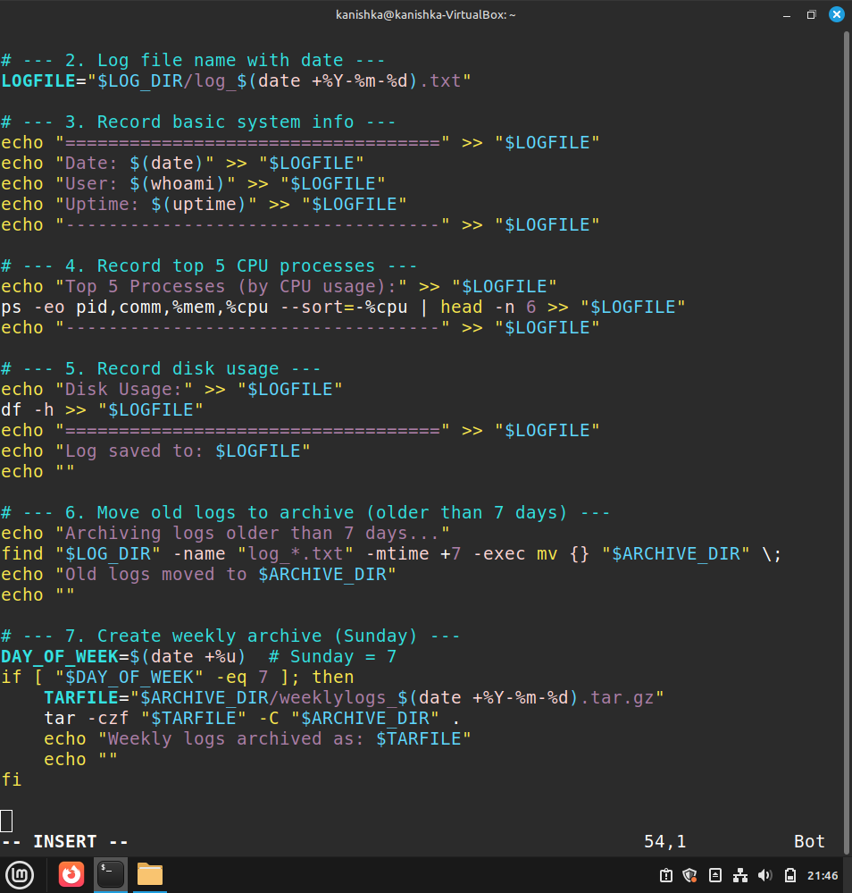

                               MID TERM PROJECT

Name - Kanishka Diwakar
Course - B.Tech(CSE)
Sap id - 590029336
Batch - 78

1. Introduction

The Daily User Log Archiver is a shell scripting project designed to automate the process of recording, organizing, and managing system logs on a Linux system.
The project utilizes various Linux commands to collect essential system information, store it in structured log files, and automatically archive older logs.
It demonstrates fundamental Bash scripting concepts such as file manipulation, loops, conditions, and scheduling using cron.

2. Objectives

The main objectives of the project are:

To identify the current system user and log their activity.

To collect and store system information such as uptime, running processes, and disk usage.

To automatically manage and archive logs older than seven days.

To automate the script execution using a cron job that runs daily.

To demonstrate the use of shell commands, conditions, and automation in Linux.

3. Tools and Technologies Used

Tool / Command	Purpose

Whoami -	Identifies the current user.
Date -	Retrieves the current date and time.
Uptime -	Displays system uptime and load average.
Ps -	Lists running processes with CPU and memory usage.
Df -	Shows disk usage details.
mkdir, find, tar -	Used for file creation, searching, and archiving.
Crontab -	Schedules the script to run automatically every day.
Bash -	Shell interpreter used to execute the script.

4. Implementation

*The script begins by defining directory paths for storing logs and archives.
*It then checks if the directories exist and creates them if necessary.
*A new log file is generated daily with the current date as part of the filename (e.g., log_2025-10-19.txt).
*The script writes the following information into each log file:
Current date and user name

System uptime

Top five CPU-consuming processes

Disk usage summary

Logs older than seven days are automatically compressed into a .tar.gz archive using the tar command and stored in an archive subdirectory.
A find command is used to identify old log files based on modification time (-mtime +7).
Finally, a cron job is added to execute the script daily at 8:00 PM.

5. Results

Upon successful execution, the script creates a new log file each day in the ~/daily_logs directory.
Logs older than seven days are moved to the archive folder and compressed.
The output of each command (user, uptime, processes, disk usage) can be verified in the log file.
The cron job ensures the script runs daily, demonstrating automation and file management concepts effectively.

6. Conclusion

The Daily User Log Archiver successfully automates daily system monitoring and log management using Bash scripting.
It provides a simple yet effective solution for maintaining system logs without manual effort.
The project demonstrates practical knowledge of Linux commands, file handling, loops, conditions, and cron scheduling — fulfilling all midterm project requirements.

Script code_

Script Execution_

Generated  log file_ 

Archive Directory_ 

Crontab_

